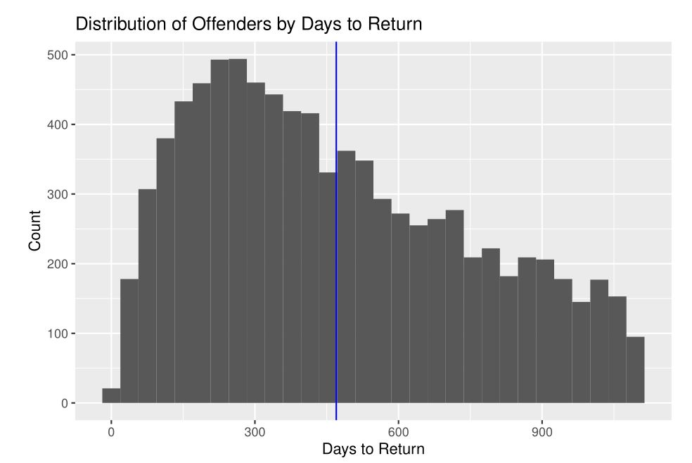
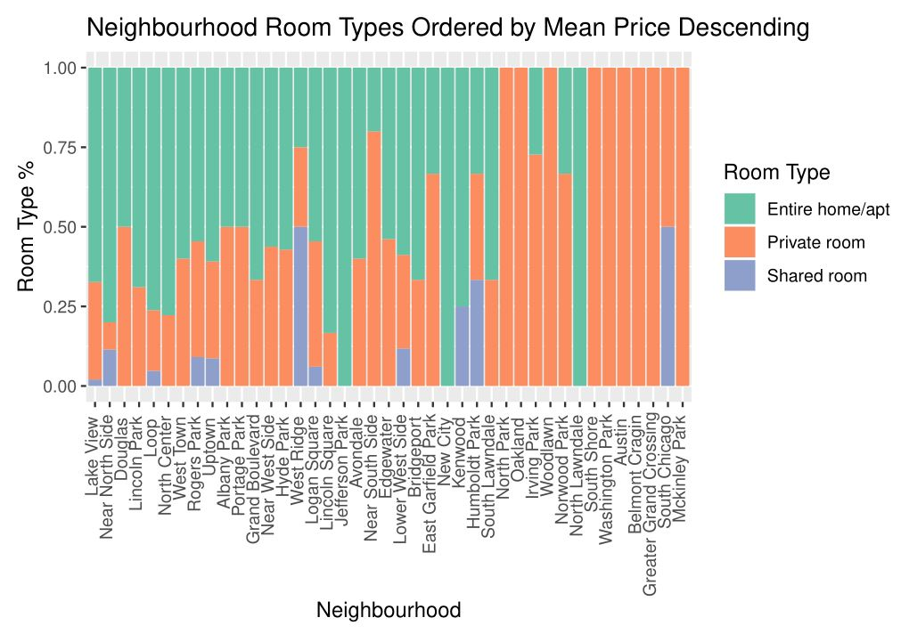

  \
  
### Google Reviews Scraper and Cleaner

#### Description:

Written to gather data for my position as Undergraduate Research Assistant at Iowa State. In its current form, it reads a file of locations, finds them through Google, and records all their reviews which are then written to another file. Written in Python, specifically Selenium and pandas packages. Supplemental code is used to process the data as needed and output a final file of all locations with various measurements for each. \  

#### Github Links: \  

https://github.com/spencerqbrown/scrape \  

https://github.com/spencerqbrown/clean \  
\  
&nbsp;

&nbsp;

### ISU Data Science 303 Final Project

#### Description:

Using publically available prisoner recidivism data from the state of Iowa, we attempted to build models for two purposes: First, predicting whether a released prisoner would return within three years and second, predicting the length of time before recidivism given that it occurs within three years. The final compiled results are not available at the below link, but all of our code should be listed. \  

#### Github Link: \  

https://github.com/spencerqbrown/DS-303-Final-Project
\  
&nbsp;

&nbsp;
\  
&nbsp;

&nbsp;
\  
&nbsp;

&nbsp;

### ISU Data Science 202 Final Project

#### Description:

Using a dataset of all Airbnb listings in Chicago, we analyzed and visualized a wide variety of factors of the dataset, e.g. mean price by neighborhood. The full project should be available at the below link. \  

#### Github Link: \  

https://github.com/spencerqbrown/ds202_project
\  
&nbsp;

&nbsp;

